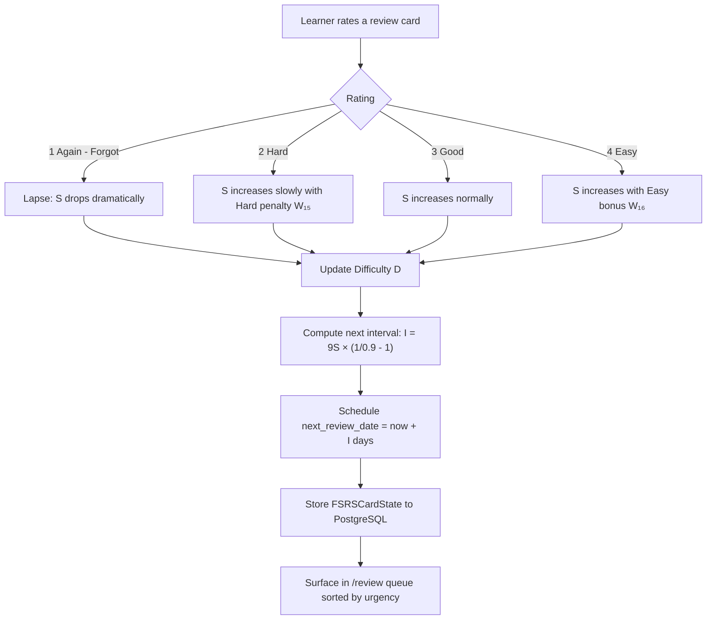
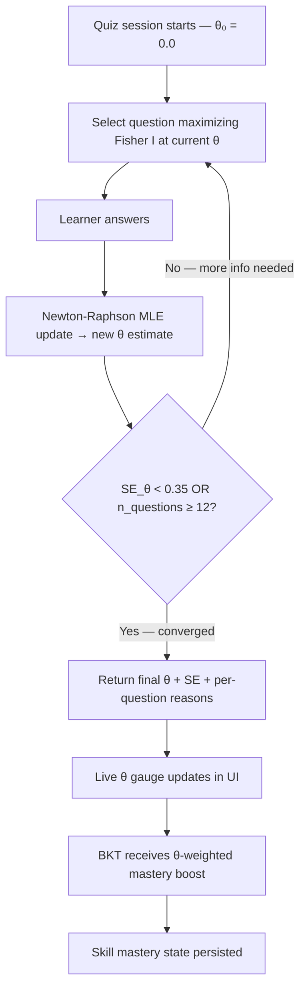
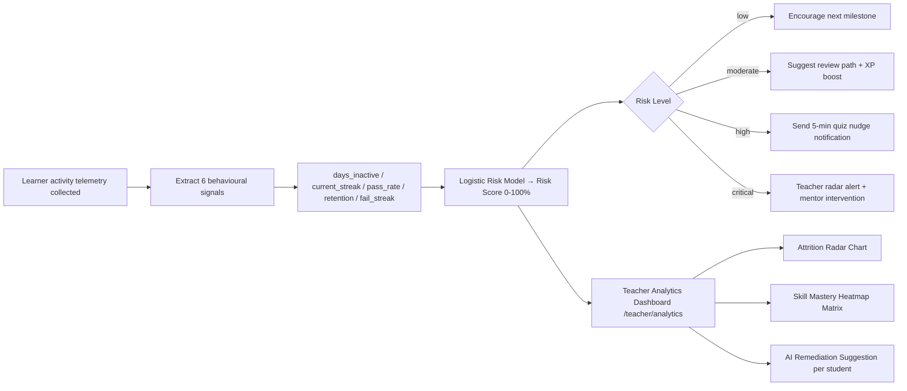
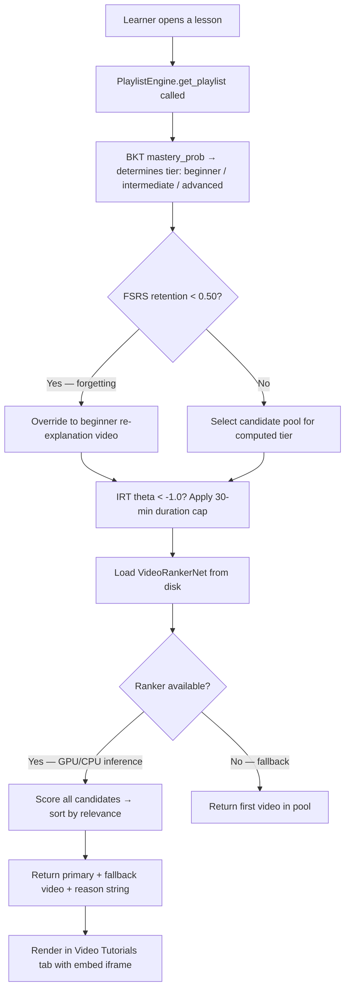
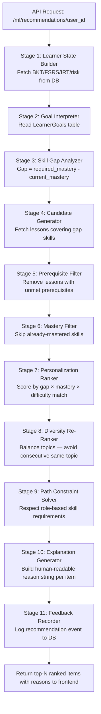
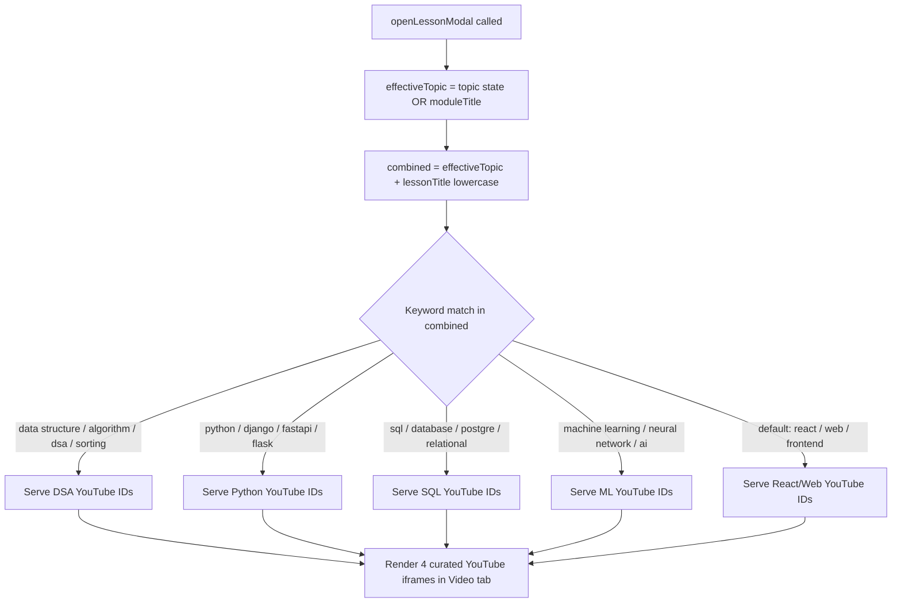
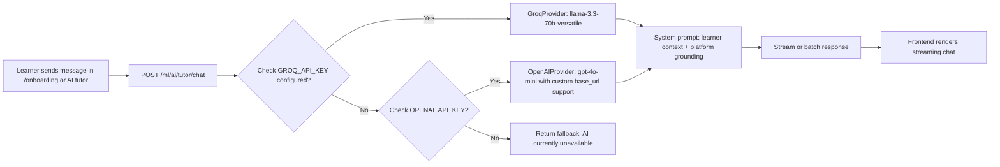
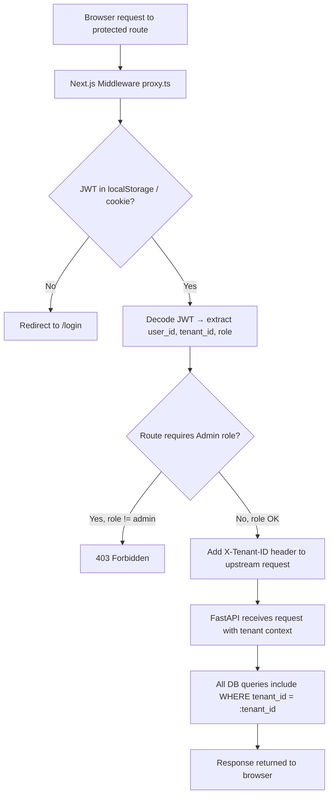

# 🧠 Learn-it HCL

**The Next-Gen Evidence-Based AI Learning Platform**

> Understand the learner → Quantify true mastery → Predict memory retention & dropout risk → Deliver adaptive personalized learning → Explain every decision.

[](https://learn-it-hcl.vercel.app)
[](https://ca-learnit-backend.agreeableocean-d133ab66.eastasia.azurecontainerapps.io/docs)
[](LICENSE)

---

## 🌟 Why Learn-it HCL?

Most learning platforms measure **completion** — did you watch the video? Did you click through the quiz? Learn-it HCL measures **mastery** — do you actually know it? Will you remember it next week?

| Problem | Traditional Platform | **Learn-it HCL** |
|---|---|---|
| Measuring knowledge | Video completion % | BKT mastery probability P(Lₜ) |
| Scheduling reviews | None / arbitrary | FSRS v4 memory retention curve |
| Assessing ability | Fixed-length quizzes | 2PL IRT Computerized Adaptive Testing |
| Recommending content | Static catalogue | 11-stage ML personalization pipeline |
| Video curation | Manual / static | PyTorch Neural MLP Ranker |
| Student retention | No early warning | Logistic Dropout Risk Predictor |
| Explainability | Black-box | Full "Why this?" reason strings |

---

## 🏗️ System Architecture

```
┌──────────────────────────────────────────────────────────────────────────────────┐
│                          LEARN-IT HCL — SYSTEM ARCHITECTURE                      │
└──────────────────────────────────────────────────────────────────────────────────┘

  ┌────────────────────────────────────┐      ┌────────────────────────────────────┐
  │        NEXT.JS 15 FRONTEND         │      │      FASTAPI ML MICROSERVICE       │
  │  (Vercel — Edge CDN)               │      │  (Azure Container Apps — v8)       │
  │                                    │      │                                    │
  │  • Adaptive Quiz + Live θ Gauge    │ HTTP │  • BKT — Bayesian Knowledge Tracing│
  │  • Skill Mastery SVG Rings         │◄────►│  • FSRS v4 Spaced Repetition       │
  │  • FSRS Spaced Review Queue        │  +   │  • 2PL IRT + CAT Adaptive Engine   │
  │  • Gamification (XP/Streaks)       │ JWT  │  • Dropout & Churn Risk Predictor  │
  │  • Teacher Attrition Radar         │      │  • Neural Video Ranker (PyTorch)   │
  │  • AI Course Generator (LangGraph) │      │  • 11-Stage Recommendation Pipeline│
  │  • AI Tutor Chat                   │      │  • AI Tutor Chat (LLM Bridge)      │
  └────────────────────────────────────┘      └────────────────────────────────────┘
                    │                                            │
                    ▼                                            ▼
  ┌────────────────────────────────────┐      ┌────────────────────────────────────┐
  │     PRISMA ORM (Node.js Layer)     │      │   SQLALCHEMY ASYNC (Python Layer)  │
  │  • Schema migrations               │      │  • BKT / FSRS / IRT state per user │
  │  • Auth & RBAC queries             │      │  • Video catalogue reads            │
  └────────────────────────────────────┘      └────────────────────────────────────┘
                    │                                            │
                    └────────────────┬───────────────────────────┘
                                     ▼
                    ┌────────────────────────────────────┐
                    │  AZURE POSTGRESQL FLEXIBLE SERVER  │
                    │  • Multi-tenant row-level security  │
                    │  • BKT/FSRS/IRT state storage       │
                    │  • pgvector (semantic search)       │
                    └────────────────────────────────────┘
```

---

## 🧠 Feature Deep-Dive

---

### 1. Bayesian Knowledge Tracing (BKT)

**What it does:** Tracks the *hidden* probability that a learner truly knows a skill (P(Lₜ)), updated after every quiz attempt, practice event, or lesson watch.

**Why this approach:** Traditional platforms treat quiz scores as direct competency signals. BKT models skill knowledge as a hidden state in a Hidden Markov Model — accounting for the fact that a student can guess correctly *without* knowing (guess rate P(G)) and fail *despite* knowing (slip rate P(S)).

**Implementation:** [`backend/app/modules/mastery/bkt.py`](backend/app/modules/mastery/bkt.py)

```
BKT Parameters (per skill):
  P(L₀) = 0.10  — Prior knowledge before any evidence
  P(T)  = 0.15  — Probability of learning from a single attempt
  P(S)  = 0.10  — Slip: answer wrong even though you know it
  P(G)  = 0.20  — Guess: answer right even though you don't know it
```

**Workflow:**

```mermaid
flowchart LR
    A[Learner submits quiz answer] --> B{Correct or Incorrect?}
    B -->|Correct| C["P(posterior) = P(L)×(1-S) / [P(L)×(1-S) + (1-P(L))×G]"]
    B -->|Incorrect| D["P(posterior) = P(L)×S / [P(L)×S + (1-P(L))×(1-G)]"]
    C --> E["P(Lₜ) = P(posterior) + (1-P(posterior))×P(T)"]
    D --> E
    E --> F["Store new mastery in PostgreSQL"]
    F --> G["Update Skill Mastery Ring in UI"]
    G --> H{P(Lₜ) ≥ 0.80?}
    H -->|Yes| I[Skill Mastered — unlock next skill]
    H -->|No| J[Schedule FSRS review + suggest practice]
```

---

### 2. FSRS v4 Spaced Repetition

**What it does:** Schedules when to review each skill to keep memory above a 90% retention target, using the power-law forgetting curve.

**Why this approach:** The classic Leitner box system uses fixed intervals (1, 7, 14, 30 days). SM-2 (used by Anki) uses a simpler algorithm. FSRS v4, published in 2022, outperforms both through a trainable 17-parameter model tracking **Difficulty (D)** and **Stability (S)** separately per card, then computing **Retrievability R(t,S)** as a power-law decay function.

**Implementation:** [`backend/app/modules/mastery/fsrs.py`](backend/app/modules/mastery/fsrs.py)

```
Core Equations:
  R(t, S) = (1 + t / 9S)^(-1)          — Forgetting curve
  I       = 9S × (R_target^(-1) - 1)   — Optimal interval
  R_target = 0.90                        — 90% desired retention
```

**Workflow:**



---

### 3. Computerized Adaptive Testing with 2PL IRT

**What it does:** Selects the next quiz question that maximizes diagnostic precision for *this specific learner's current ability*, converging on an accurate θ estimate in ~7-10 questions instead of 20+.

**Why this approach:** Fixed-length quizzes waste time — easy questions give no signal for expert learners, hard questions frustrate beginners. The 2-Parameter Logistic IRT model characterizes each question by **difficulty (b)** and **discrimination (a)**, then uses **Fisher Information I(θ)** to pick whichever unanswered question reduces ability uncertainty most.

**Implementation:** [`backend/app/modules/assessments/irt.py`](backend/app/modules/assessments/irt.py) · [`backend/app/modules/assessments/cat_engine.py`](backend/app/modules/assessments/cat_engine.py)

```
2PL Probability:  P(correct | θ, a, b) = 1 / (1 + exp(-a(θ - b)))
Fisher Info:      I(θ) = a² × P(θ) × (1 - P(θ))
θ Estimation:     Newton-Raphson MLE (converges in ≤ 20 iterations)
```

**Workflow:**



---

### 4. Dropout Risk Predictor

**What it does:** Computes a 0–100 risk score for each learner based on behavioural signals. Teachers see an **attrition radar** dashboard with at-risk students highlighted and specific remediation nudges generated.

**Why this approach:** A logistic regression with hand-crafted behavioural features is interpretable, auditable, and trainable on historical data — unlike black-box deep models which require thousands of labelled samples. Each coefficient can be explained to a teacher: "inactivity for 5+ days increases dropout probability by ~20%."

**Implementation:** [`backend/app/modules/analytics/risk_predictor.py`](backend/app/modules/analytics/risk_predictor.py)

```
Risk Score = sigmoid(β₀ + W_inactive×days_inactive + W_streak×streak
                         + W_pass_rate×pass_rate + W_retention×retention
                         + W_fail_streak×consecutive_failures)

Risk Tiers:
  0–25%    → Low risk — encourage progression
  25–50%   → Moderate — recommend personalized review path
  50–75%   → High — send 5-minute bite-sized quiz nudge
  75–100%  → Critical — trigger direct mentor intervention
```

**Workflow:**



---

### 5. Neural Video Ranker (PyTorch MLP)

**What it does:** Re-ranks curated YouTube videos for each lesson by predicting semantic relevance given a learner's current ability θ, normalized video duration, and topic one-hot encoding.

**Why this approach:** A fully static catalogue would show the same 3 videos to every learner regardless of their level. A 7-dimensional feature MLP (ability + duration + topic_onehot) is lightweight enough to run in under 2ms per inference on CPU while still personalizing the video order. The model is trained with Gaussian noise data augmentation (4× expansion) to prevent overfitting on the small 135-sample catalogue.

**Implementation:** [`backend/app/modules/recommendations/video_ranker.py`](backend/app/modules/recommendations/video_ranker.py) · [`backend/app/modules/recommendations/playlist_engine.py`](backend/app/modules/recommendations/playlist_engine.py)

```
Architecture: 3-layer MLP
  Input  (7-dim): [ability_norm, duration_norm, topic_onehot×5]
  Layer 1: Linear(7→32) + ReLU
  Layer 2: Linear(32→16) + ReLU
  Layer 3: Linear(16→1) + Sigmoid
  Output: relevance score ∈ [0, 1]

Training: Adam + CosineAnnealing LR, 300 epochs, MSELoss
GPU: Auto-detects CUDA, falls back to CPU
```

**Workflow:**



---

### 6. 11-Stage Recommendation Pipeline

**What it does:** Every content recommendation passes through 11 sequential ML stages to go from raw learner state to a ranked, explainable list of lessons, courses, and skills.

**Why this approach:** A single-function recommender is brittle. The pipeline pattern lets each stage be independently testable, swappable, and logged. Every output carries a `reasons` array so the UI can display "Why this?" explanations to the learner.

**Implementation:** [`backend/app/modules/recommendations/engine.py`](backend/app/modules/recommendations/engine.py)

**Workflow:**



---

### 7. AI Course Generator (LangGraph Agent)

**What it does:** Generates a full interactive course roadmap — modules, lessons, quiz questions, and lecture notes — from a single topic + audience input using a multi-node LangGraph workflow.

**Why this approach:** A single LLM call with a giant prompt is unreliable and hard to debug. LangGraph structures generation as a directed graph of nodes: `generate_roadmap` → `generate_materials` → `generate_tests` → `add_supplementary_resources`. Each node has its own prompt, temperature, and retry logic, and the state object flows cleanly between nodes.

**Implementation:** [`backend/app/modules/ai_course_agent/agent.py`](backend/app/modules/ai_course_agent/agent.py) · [`apps/web/app/api/ai/course/generate/route.ts`](apps/web/app/api/ai/course/generate/route.ts)

**Workflow:**



```mermaid
flowchart LR
    A[User: Topic + Audience + Language] --> B[Next.js API Route /api/ai/course/generate]
    B --> C[Proxy to FastAPI /ml/ai/course/generate]
    C --> D[LangGraph StateGraph starts]
    D --> E[Node 1: generate_roadmap\nGroq LLM → structured JSON modules]
    E --> F[Node 2: generate_materials\nPer-lesson lecture notes + GFG URL + docs URL]
    F --> G[Node 3: generate_tests\nMultiple-choice quiz questions with correct answers]
    G --> H[Node 4: add_supplementary_resources\nYouTube search links per module]
    H --> I[Final AgentState returned]
    I --> J[Frontend renders interactive roadmap timeline]
    J --> K[Lesson modal: lecture notes + topic-aware YouTube videos + GFG]
```

**Topic-Aware Video Selection (Frontend):**



---

### 8. AI Tutor Chat

**What it does:** Scaffolded conversational tutor that grounds answers in the platform's content, maintains session context, and routes to the configured LLM provider (Groq / OpenAI / custom base_url).

**Why this approach:** The `AIProvider` abstract interface decouples the tutor logic from the LLM vendor. Swapping from Groq Llama to OpenAI GPT-4o or a local Ollama instance requires only a config change — no code modification. The tutor uses a system prompt that explicitly references the learner's current skill mastery context.

**Implementation:** [`backend/app/modules/ai_assistant/service.py`](backend/app/modules/ai_assistant/service.py)



---

### 9. Multi-Tenant Auth & RBAC

**What it does:** Every database row is scoped to a `tenant_id`. JWT tokens carry `user_id`, `tenant_id`, and `role`. The Next.js middleware validates tokens on every protected route before allowing access.

**Why this approach:** Row-level `tenant_id` isolation in PostgreSQL means a single database serves all organizations without data leakage. The 5-role RBAC (Student → Teacher → Admin → Super Admin → Platform Owner) maps directly to Next.js route groups and FastAPI dependency injection.

**Implementation:** [`apps/web/proxy.ts`](apps/web/proxy.ts) · [`backend/app/core/`](backend/app/core/)



---

## 📁 Repository Structure

```
Learn-it-HCL/
├── apps/
│   └── web/                          # Next.js 15 Frontend (Vercel)
│       ├── app/
│       │   ├── (app)/                # Protected app pages
│       │   │   ├── dashboard/        # XP, streaks, daily missions
│       │   │   ├── courses/          # Course catalogue + AI generator
│       │   │   │   └── [courseId]/
│       │   │   │       ├── [topicId]/[subtopicId]/  # Lesson player
│       │   │   │       └── quiz/     # Adaptive CAT quiz interface
│       │   │   ├── skills/           # BKT mastery rings
│       │   │   ├── review/           # FSRS review queue
│       │   │   ├── achievements/     # Badges, XP log, quests
│       │   │   ├── learning-paths/   # Prerequisite DAG roadmap
│       │   │   ├── teacher/          # Attrition radar + heatmap
│       │   │   ├── onboarding/       # AI conversational onboarding
│       │   │   └── admin/settings/   # System settings
│       │   ├── (auth)/               # Login / signup pages
│       │   └── api/                  # Next.js proxy routes → FastAPI
│       │       └── ai/course/        # generate/ + save/ + quiz/
│       ├── components/               # UI components
│       │   ├── ai-course-generator.tsx  # LangGraph course generator UI
│       │   ├── course/               # Course context + player
│       │   └── ui/                   # shadcn/ui primitives
│       ├── lib/
│       │   └── api.ts                # Typed API client
│       └── prisma/
│           └── schema.prisma         # PostgreSQL schema (Prisma ORM)
│
├── backend/                          # FastAPI ML Microservice (Azure)
│   ├── app/
│   │   ├── main.py                   # App entry + router registration
│   │   ├── config.py                 # Settings (env vars, AI provider)
│   │   ├── database.py               # SQLAlchemy AsyncPG engine
│   │   ├── generated_models.py       # SQLAlchemy table models
│   │   ├── data/
│   │   │   └── video_catalogue.json  # Curated YouTube video pool by topic+tier
│   │   └── modules/
│   │       ├── mastery/
│   │       │   ├── bkt.py            # Bayesian Knowledge Tracing HMM
│   │       │   ├── fsrs.py           # FSRS v4 Spaced Repetition Scheduler
│   │       │   └── service.py        # Mastery state CRUD
│   │       ├── assessments/
│   │       │   ├── irt.py            # 2PL IRT model (Newton-Raphson MLE)
│   │       │   └── cat_engine.py     # Computerized Adaptive Testing selector
│   │       ├── analytics/
│   │       │   └── risk_predictor.py # Logistic Dropout Risk Predictor
│   │       ├── recommendations/
│   │       │   ├── engine.py         # 11-stage recommendation pipeline
│   │       │   ├── playlist_engine.py # ML-driven YouTube playlist selector
│   │       │   └── video_ranker.py   # PyTorch 3-layer MLP neural ranker
│   │       ├── ai_assistant/
│   │       │   └── service.py        # Multi-provider AI tutor (Groq/OpenAI)
│   │       └── ai_course_agent/
│   │           └── agent.py          # LangGraph course generation agent
│   ├── alembic/                      # Database migration scripts
│   ├── scripts/
│   │   ├── seed.py                   # Seed data (users, courses, lessons)
│   │   └── train_models.py           # Neural ranker training script
│   └── saved_models/                 # Persisted ML model weights (.pt / .joblib)
│
├── infra/
│   ├── docker/                       # Docker Compose for local dev
│   └── apisix/                       # Gateway config (multi-tenant routing)
├── .github/
│   └── workflows/
│       └── deploy.yml                # CI/CD: build → push ACR → deploy ACA
└── packages/
    └── types/                        # Shared TypeScript contracts
```

---

## 🖥️ Application Pages

| Route | Feature | ML Signals Used |
|---|---|---|
| `/dashboard` | XP progression, daily missions, active quests | BKT mastery, Risk score |
| `/courses` | AI Course Generator + lesson player | LangGraph agent |
| `/courses/[id]/quiz` | Adaptive CAT quiz + live θ gauge | 2PL IRT, CAT, BKT |
| `/skills` | Skill mastery rings (SVG) | BKT P(Lₜ) per skill |
| `/review` | FSRS review queue sorted by urgency | FSRS R(t,S), intervals |
| `/achievements` | XP log, badges, day streak, quests | Engagement signals |
| `/learning-paths` | Prerequisite DAG roadmap | Recommendation pipeline |
| `/teacher/analytics` | Attrition radar + remediation AI | Dropout risk, mastery heatmap |
| `/onboarding` | AI conversational onboarding | LLM (Groq / OpenAI) |
| `/admin/settings` | System configuration | — |

---

## 🚀 Quick Start

### Prerequisites

- Node.js ≥ 20 + pnpm ≥ 9
- Python ≥ 3.12
- PostgreSQL 16 (or Docker)

### 1. Clone & Install

```bash
git clone https://github.com/Kowsik-Y/Learn-it-HCL.git
cd Learn-it-HCL
pnpm install
```

### 2. Environment Setup

```bash
cp .env.example .env
# Set DATABASE_URL, GROQ_API_KEY or OPENAI_API_KEY, JWT_SECRET
```

**Required environment variables:**

| Variable | Description |
|---|---|
| `DATABASE_URL` | PostgreSQL connection string (prisma format) |
| `DIRECT_URL` | Direct PostgreSQL URL (for migrations) |
| `GROQ_API_KEY` | Groq API key (preferred — free tier available) |
| `OPENAI_API_KEY` | OpenAI API key (optional, falls back if Groq set) |
| `OPENAI_BASE_URL` | Custom OpenAI-compatible base URL (optional) |
| `JWT_SECRET` | Secret for JWT signing |
| `NEXT_PUBLIC_API_URL` | FastAPI backend URL |

### 3. Run ML Backend

```bash
cd backend
python -m venv .venv
source .venv/bin/activate     # Windows: .venv\Scripts\activate
pip install -e ".[dev]"

# Apply schema + seed data
alembic upgrade head
PYTHONPATH=. python scripts/seed.py

# (Optional) Train neural video ranker
PYTHONPATH=. python scripts/train_models.py

# Start server
uvicorn app.main:app --reload --port 8000
```

### 4. Run Next.js Frontend

```bash
cd apps/web
npx prisma db push          # Sync Prisma schema
pnpm dev                    # Starts on http://localhost:3000
```

### 5. Access Points

| Service | URL |
|---|---|
| **Web App** | `http://localhost:3000` |
| **ML API Docs** (Swagger) | `http://localhost:8000/docs` |
| **Health Check** | `http://localhost:8000/health` |

### 🔑 Demo Credentials

| Role | Email | Password |
|---|---|---|
| **Student** | `student@learnit.dev` | `Password1!` |
| **Teacher** | `teacher@learnit.dev` | `Password1!` |
| **Admin** | `admin@learnit.dev` | `Password1!` |

---

## ☁️ Production Deployment

### Architecture (Live)

| Component | Service | URL |
|---|---|---|
| **Frontend** | Vercel (auto-deploy on push to `main`) | `learn-it-hcl.vercel.app` |
| **Backend ML API** | Azure Container Apps (revision `v8`) | `ca-learnit-backend.agreeableocean-d133ab66.eastasia.azurecontainerapps.io` |
| **Database** | Azure PostgreSQL Flexible Server | `psql-learnit-3c1v74.postgres.database.azure.com` |
| **Container Registry** | Azure Container Registry (ACR) | `acrlearnit.azurecr.io` |

### CI/CD Pipeline

```mermaid
flowchart LR
    A[git push to main] --> B[GitHub Actions Workflow]
    B --> C[az login with Service Principal]
    C --> D[docker build backend image]
    D --> E[docker push to Azure Container Registry]
    E --> F[az containerapp update — deploy new revision]
    F --> G[Azure Container Apps routes traffic to new revision]
    G --> H[Vercel auto-deploys frontend from main branch]
```



```bash
# Required GitHub Secrets:
AZURE_CLIENT_ID       # Service principal client ID
AZURE_TENANT_ID       # Azure tenant ID
AZURE_SUBSCRIPTION_ID # Azure subscription ID
ACR_NAME              # Container registry name
RESOURCE_GROUP        # Azure resource group name
ACA_APP               # Container app name
```

---

## 🏆 Comparison with Existing Platforms

| Feature | Coursera / Udemy | Khan Academy | Duolingo | **Learn-it HCL** |
|---|---|---|---|---|
| **Mastery Tracking** | Video Completion | Quiz Scores | Streak Count | **BKT Probabilistic P(Lₜ)** |
| **Spaced Repetition** | None | Basic | Leitner System | **FSRS v4 ML Scheduler** |
| **Diagnostic Testing** | Fixed Length | Static Quizzes | Fixed Tests | **2PL IRT + CAT (Fisher Info)** |
| **Video Curation** | Static / Manual | Static | N/A | **PyTorch Neural MLP Ranker** |
| **Student Attrition** | None | None | None | **Logistic Dropout Risk Predictor** |
| **Explainability** | No | Partial | No | **Full "Why this?" reason strings** |
| **Course Generation** | Human-authored | Human-authored | Human-authored | **LangGraph AI Agent** |

---

## 📄 License

MIT © Learn-it HCL Team
