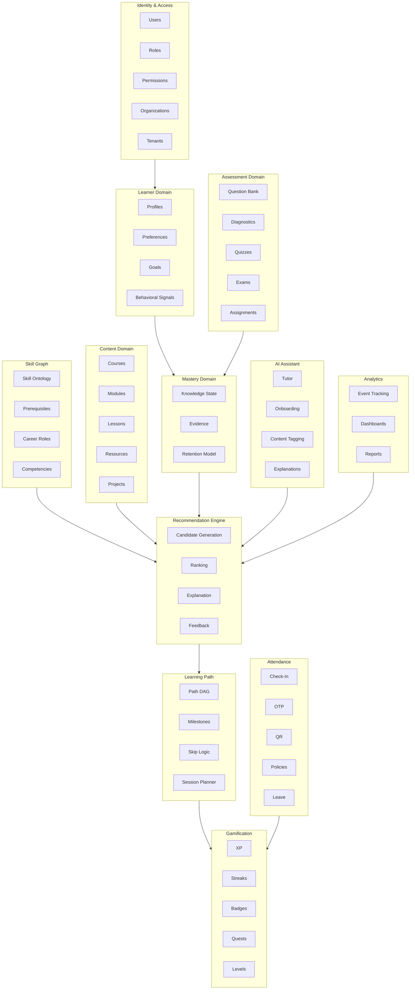
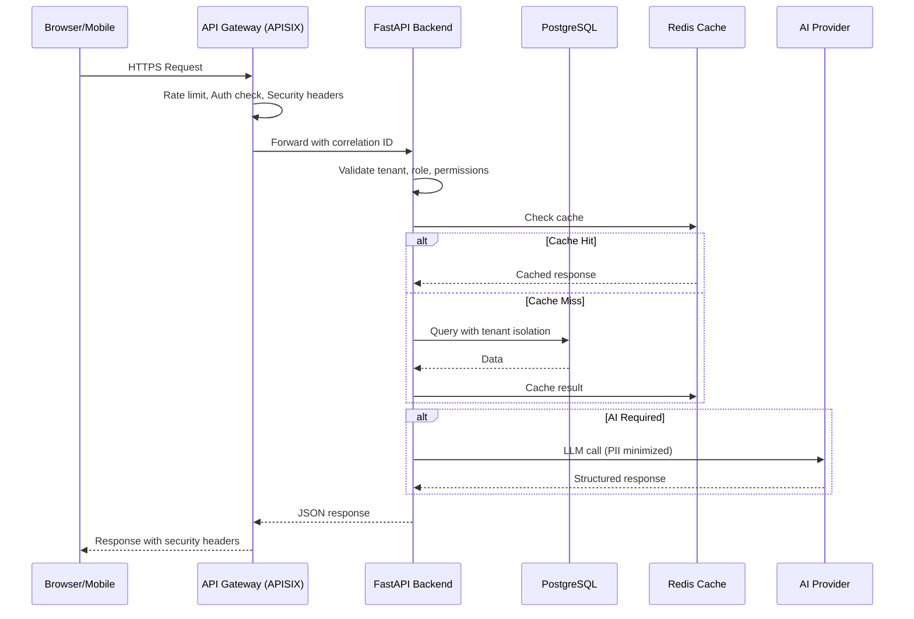
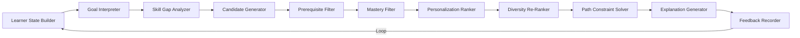
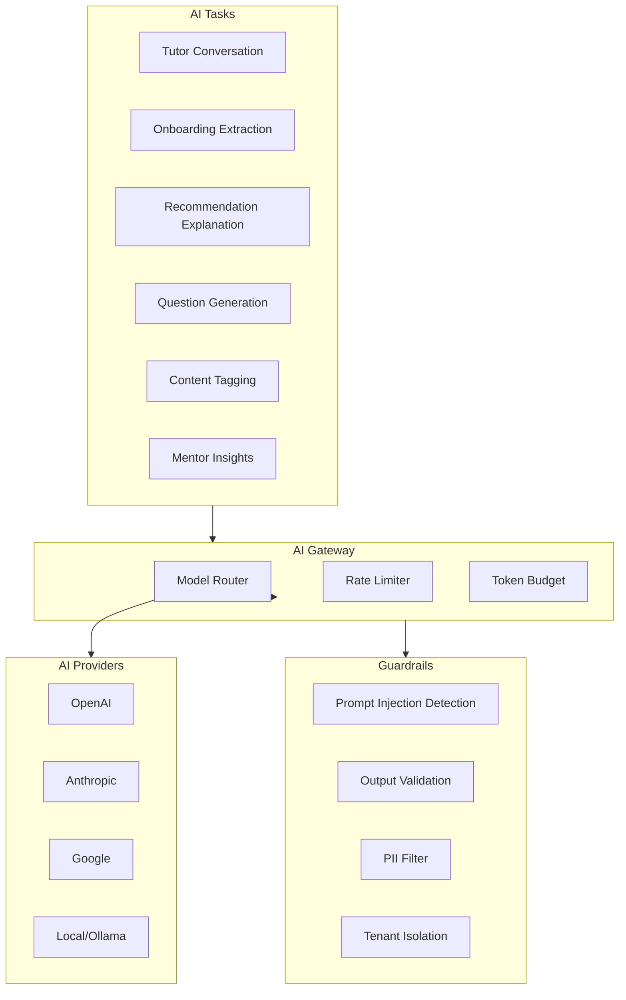
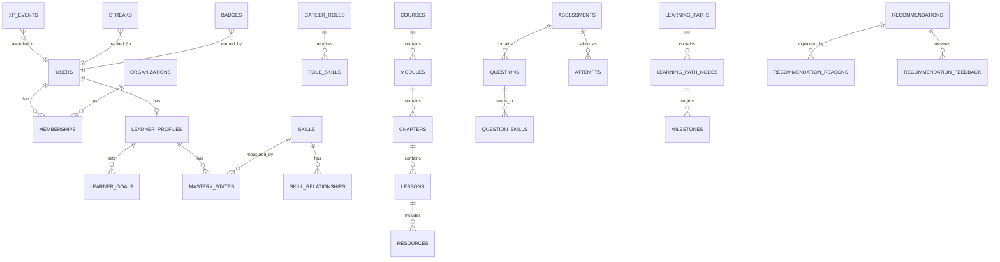

# Learn-it HCL — Architecture

## System Overview

Learn-it HCL is an **adaptive learning operating system** built as a modular monolith. The platform combines conversational AI, learner profiling, adaptive diagnostics, skill-gap analysis, prerequisite-aware learning paths, and gamification into a single cohesive product.

## Core Principle

```
Rules decide what is allowed.
ML estimates what is likely.
LLM explains and communicates.
```

## Bounded Contexts



## Request Flow



## Recommendation Pipeline



## AI Architecture



## Data Model Overview



## Technology Stack

| Component | Technology | Purpose |
|---|---|---|
| Frontend | Next.js 16 + React 19 | Server/Client rendering |
| UI Components | shadcn/ui + Tailwind CSS | Design system |
| Backend | FastAPI + Python | API server |
| ORM | SQLAlchemy 2.x | Database access |
| Database | PostgreSQL 16 + pgvector | Primary storage + vectors |
| Cache | Redis 7 | Caching + background jobs |
| API Gateway | Apache APISIX | Routing, auth, rate limiting |
| Search | PostgreSQL FTS + pgvector | Hybrid search |
| AI | OpenAI/Anthropic/Google | LLM capabilities |
| Monorepo | pnpm + Turborepo | Package management |
| Linting | Biome | Format + lint |
| Testing | pytest + Playwright | Backend + E2E |

## Multi-Tenancy

Row-level tenant isolation with `tenant_id` on all tenant-owned tables. Every data access path validates tenant + user + role + resource + action. Frontend never used as authorization boundary.

## Security Boundaries

```
Frontend ──╳──> Database (never direct)
Student  ──╳──> Mastery Scores (cannot modify)
Teacher  ──╳──> Other Tenant Data (isolated)
AI       ──╳──> Authorization Bypass (not allowed)
Recommendations ──╳──> Grade Modification (not allowed)
```
